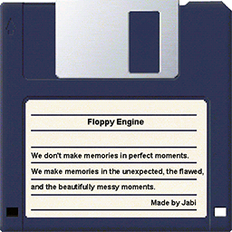
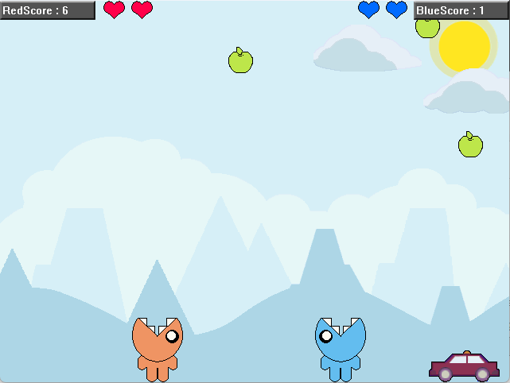

# 플로피 엔진

  

## Winapi를 이용하여 간단한 2D게임 엔진 개발

플로피 디스크를 통해 Windows XP에서 구동되는 2D게임 엔진을 개발 하고 있습니다.

목표는 구형 PC를 사용하고 있는 PC에서 몰래 게임하기 위해서 작업 되었습니다.

## 우걱 우걱

  

우걱 우걱이라는 샘플 게임이 있음

엔진의 기능을 점검하기 위한 목적으로 만들어 두었음

